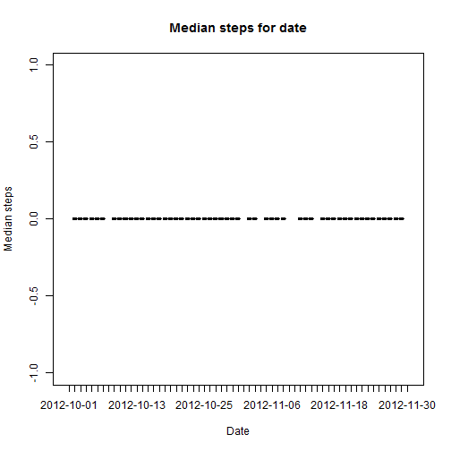

## Loading and preprocessing the data
1. Read the data from csv file by read.csv(). Keep the dataFrame in 'rawData';

2. Filter out NA value for steps from 'rawData'. There are total 2304 NA values. Keep the processed dataFrame in 'df'.


```r
#
#set work directory
#
setwd("C:\\JianWei\\Coursera\\ReproducibleResearch")
#
#read data from CSV file
#
rawData <- read.csv(file="activity.csv", header=TRUE, sep=",")
#
#do summary
#
summary(rawData)
```

```
##      steps                date          interval     
##  Min.   :  0.00   2012-10-01:  288   Min.   :   0.0  
##  1st Qu.:  0.00   2012-10-02:  288   1st Qu.: 588.8  
##  Median :  0.00   2012-10-03:  288   Median :1177.5  
##  Mean   : 37.38   2012-10-04:  288   Mean   :1177.5  
##  3rd Qu.: 12.00   2012-10-05:  288   3rd Qu.:1766.2  
##  Max.   :806.00   2012-10-06:  288   Max.   :2355.0  
##  NA's   :2304     (Other)   :15840
```

There are 2304 NA values. We need filter out NA records for data analysis.


```r
df <- subset(rawData, !is.na(rawData$steps))
```


## What is mean total number of steps taken per day?
Apply ddply() function from package {plyr} on dataFrame 'df' to do summarise.


```r
library(plyr)
#
#apply ddply function to dataFrame df on 'date' to do summarise
#
totalSteps <- ddply(df, .(date), summarise, mean=mean(steps), median=median(steps, na.rm = TRUE), sum=sum(steps))
#
#use hist() to create Histogram for total steps
#
hist(as.numeric(totalSteps$sum), main="Histogram for total steps", xlab="Total steps", ylab="Frequency of total steps",border="blue", col="green")
```

 

```r
#
#use plot() to create graph for average and median steps per date
#
plot(totalSteps$date, totalSteps$mean, type = "l", main="Average steps for date", xlab="Date", ylab="Average steps")
```

 

```r
plot(totalSteps$date, totalSteps$median, type = "l", main="Median steps for date", xlab="Date", ylab="Median steps")
```

 

## What is the average daily activity pattern?

Aapply ddply() function to dataFrame 'df' on 'interval' to do summarise


```r
#
#apply ddply function to dataFrame df on 'interval' to do summarise
#
averageSteps <- ddply(df, .(interval), summarise, mean=mean(steps), max = max(steps))
#
#use plot() function to create graph for average and median steps per interval
#
plot(averageSteps$interval, averageSteps$mean, type = "l", main="Average steps for interval", xlab="Interval", ylab="Average steps")
```

 

```r
plot(averageSteps$interval, averageSteps$max, type = "l", main="Max steps for interval", xlab="Interval", ylab="Max steps")
```

 

## Are there differences in activity patterns between weekdays and weekends?

1. Add a new factor called dayType to 'df' and keep it in dataFrame 'transDf';
2. Group the dataFrame in Weekday and Weekend two types;
3. Apply ddply() function on interval and dayType to do summarise;
4. Use plot() function to create graph for the results.
  

```r
#
#add a new factor called dayType to df 
#
transDf <- df
transDf$dayType <- as.factor(ifelse(weekdays(as.Date(df$date,'%Y-%m-%d')) %in% c("Saturday","Sunday"), "Weekend", "Weekday"))
meanDayType <- ddply(transDf, .(interval , dayType), summarise, mean=mean(steps))
meanWeekDay <- subset(meanDayType, meanDayType$dayType == "Weekday")
meanWeekEnd <- subset(meanDayType, meanDayType$dayType == "Weekend")
#
#use plot() function to create graph
#
plot(meanWeekDay$interval, meanWeekDay$mean, type = "l", main="Weekday average steps", xlab="Interval", ylab="Mean steps")
```

 

```r
plot(meanWeekEnd$interval, meanWeekEnd$mean, type = "l", main="Weekend average steps", xlab="Interval", ylab="Mean steps")
```

 

## Imputing missing values

There are total 2304 NA of steps in the csv file.

In order to fix the NA value, the strategy is to use the same day type. Since Weekday and Weekend have different patterns.

The logic is to fill in data with the average value on the same day type by matching the interval.

The funtion is built to check each NA item and find the average value by matching the interval and day type (Weekday or Weekend), then reset the steps value.


```r
sizeMatch <- length(meanWeekDay$interval)
getStepsByWeekday <- function(interval) {
    for (j in 1: sizeMatch) {
        if (interval == meanWeekDay$interval[j]) {
            matchValue <- meanWeekDay$mean[j]
            return(matchValue)
        }
    } 
}	
getStepsByWeekend <- function(interval) {
    for (j in 1: sizeMatch) {
        if (interval == meanWeekEnd$interval[j]) {
            matchValue <- meanWeekEnd$mean[j]
            return(matchValue)
        }
    } 
}	
fixData <- rawData
fixData$dayType <- as.factor(ifelse(weekdays(as.Date(fixData$date,'%Y-%m-%d')) %in% c("Saturday","Sunday"), "Weekend", "Weekday"))
size <- length(fixData$steps)
for (i in 1:size) {
    if (is.na(fixData$steps[i])) {
        dayType <- fixData$dayType[i]
        interval <- fixData$interval[i]
        if (dayType == "Weekday") {
            fixData$steps[i] <- getStepsByWeekday(interval)
        } else {
            fixData$steps[i] <- getStepsByWeekend(interval)
        }
    }
}  
totalStepsFix <- ddply(fixData, .(date), summarise, mean=mean(steps), median=median(steps, na.rm = TRUE), max = max(steps), sum=sum(steps))
#
#create Hostogram for total steps after fix NA value
#
hist(as.numeric(totalStepsFix$sum), main="Histogram for total steps after fix NA", xlab="Total steps", ylab="Frequency of total steps",border="blue", col="green")
```

 

```r
#
#use plot() to create graph for average and median steps after fix NA value
#
plot(totalStepsFix$date, totalStepsFix$mean, type = "l", main="Average steps for date after fix NA", xlab="Date", ylab="Average steps")
```

 

```r
plot(totalStepsFix$date, totalStepsFix$median, type = "l", main="Median steps for date after fix NA", xlab="Date", ylab="Median steps")
```

 


